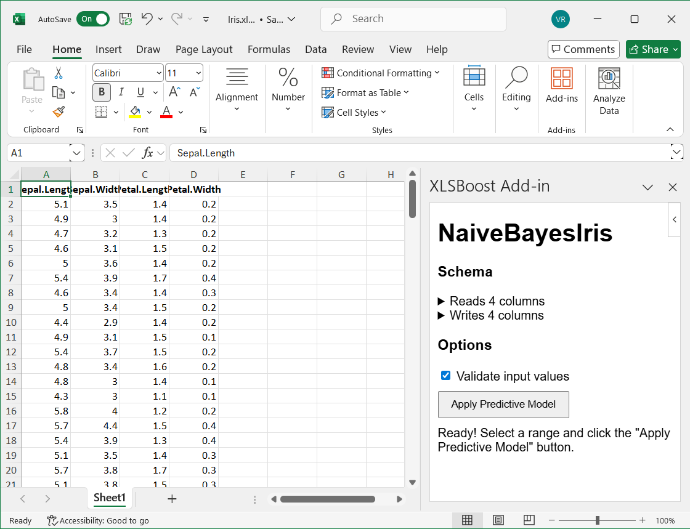

XLSBoost Excel Add-in installation instructions for Microsoft Excel Desktop.

# Add-in #

1. Download the manifest into a file in a **Trusted Add-in Catalog**.

2. Click **"Home"** > **"Add-ins"** to open the "Add-ins" menu:

   

3. Click **"More Add-ins"** to open the "Office Add-ins" dialog.

4. Switch from the default **"Store"** view to the **"Shared folder"** view:

   

   If the "Shared folder" view is missing, it means that there are no Trusted Add-in Catalogs registered yet. Fix by registering one as detailed below.

5. Choose the XLSBoost Excel Add-in from the list:

   

   If the list is empty, click "Refresh" to synchronize with Trusted Add-in Catalogs.

6. Wait for the XLSBoost Excel Add-in to load as a Taskpane App:

   

# Trusted Add-in Catalog #

1. Create a **shared folder**:

   

2. Click **"File"** > **"Options"**.

3. Select **"Trust Center"** from the left sidebar:

   

4. Click **"Trust Center Settings..."**.

5. Select **"Trusted Add-in Catalogs"** from the left sidebar:

   

6. Fill in **"Catalog Url"** by entering the UNC path to the previously created shared folder.

7. Click **"Add catalog"**.

8. Check **"Show in Menu"** on the newly added catalog entry.

   

9. Click **"OK"** to confirm changes.

10. Restart Excel.
