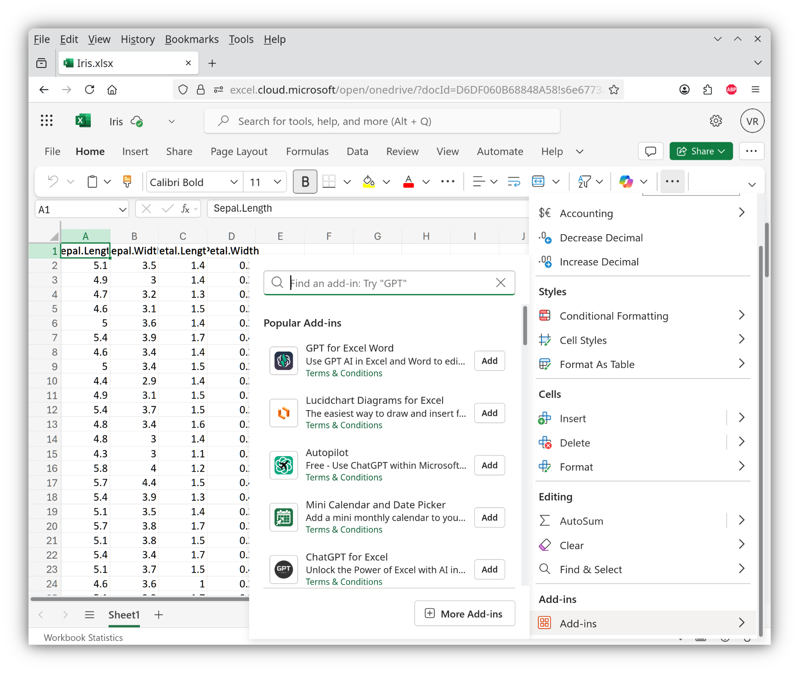
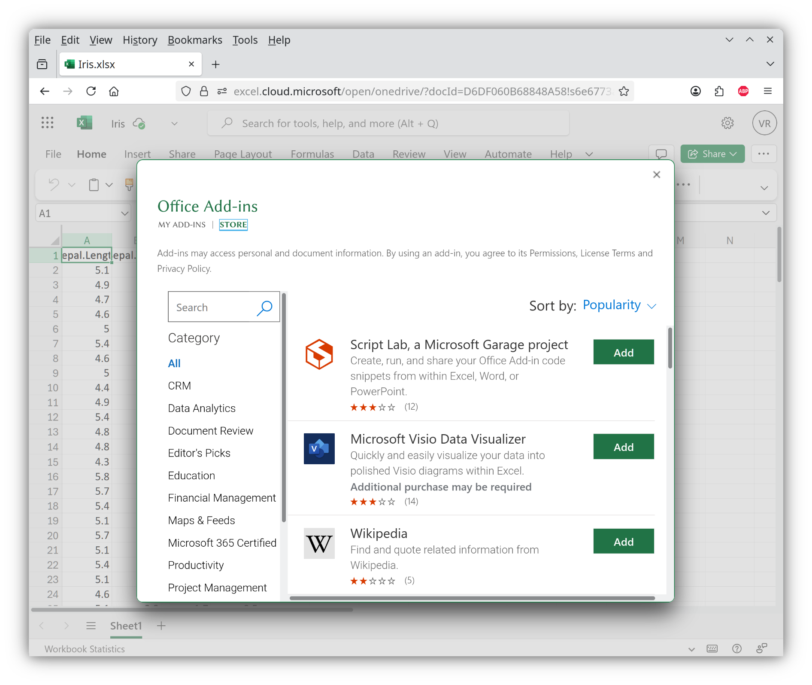
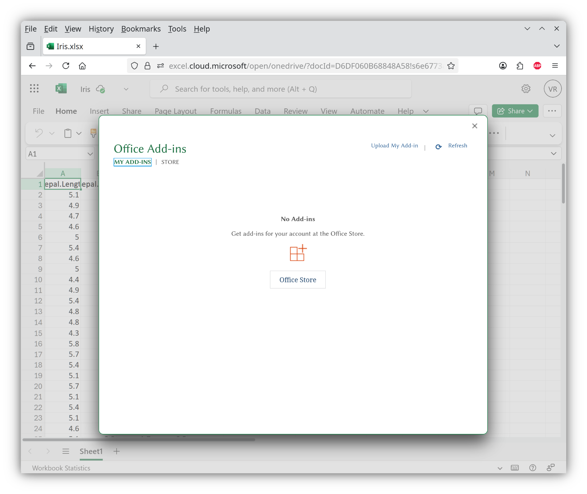
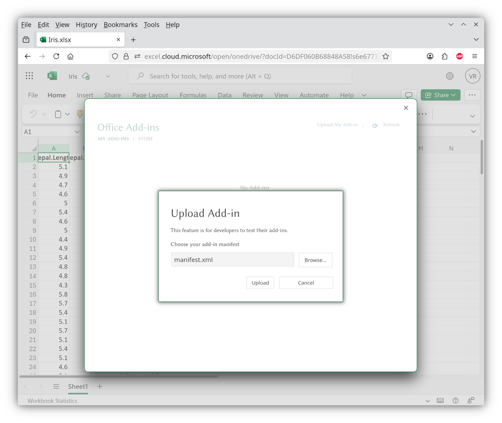
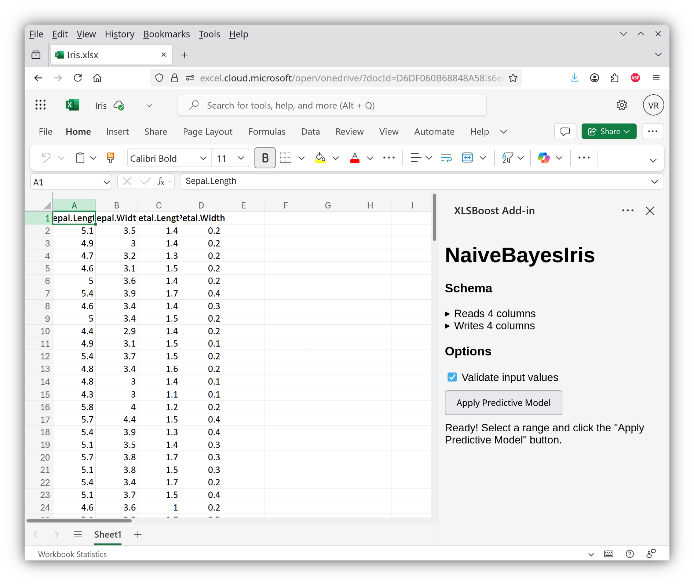

XLSBoost Excel Add-in installation instructions for [Microsoft Excel for the Web](https://excel.cloud.microsoft/):

# Overview #

1. Download the manifest file into a file in local filesystem.
2. Click **"Home"** > **"Add-ins"** to open the "Add-ins" menu:
  
3. Click **"More Add-ins"** to open the "Office Add-ins" dialog.
4. Switch from the default **"Store"** view to the **"My Add-ins"** view:
  
5. Click **"Upload My Add-in"** to open the "Upload Add-in" dialog:
  
6. Choose the previously downloaded manifest file.
7. Click **"Upload"**:
  
8. Wait for the XLSBoost Excel Add-in to load as a Taskpane App:
  
