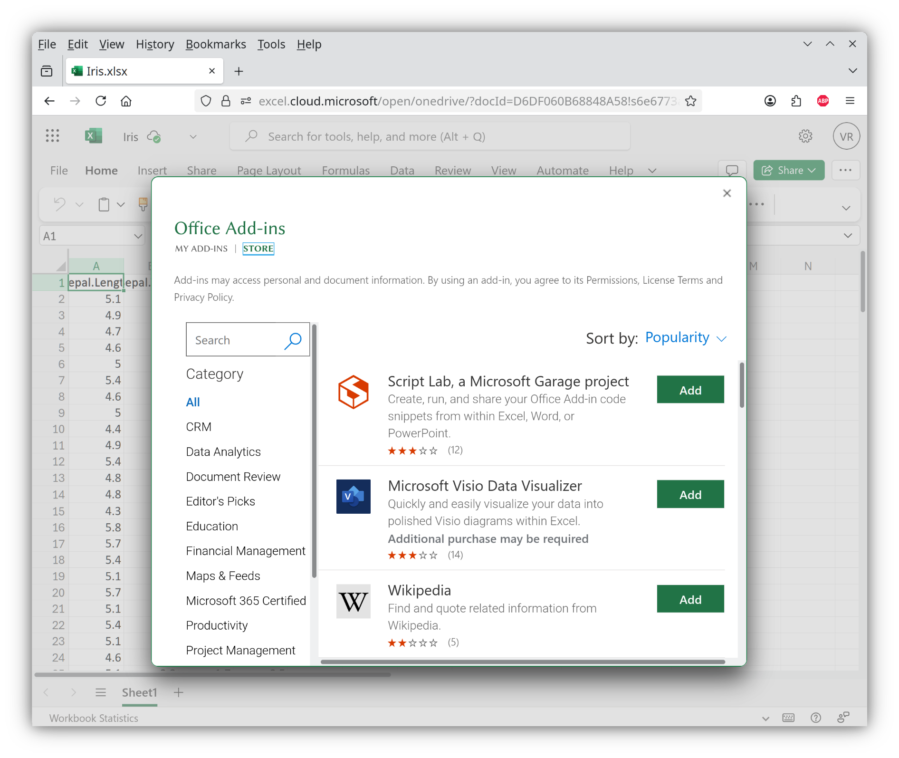
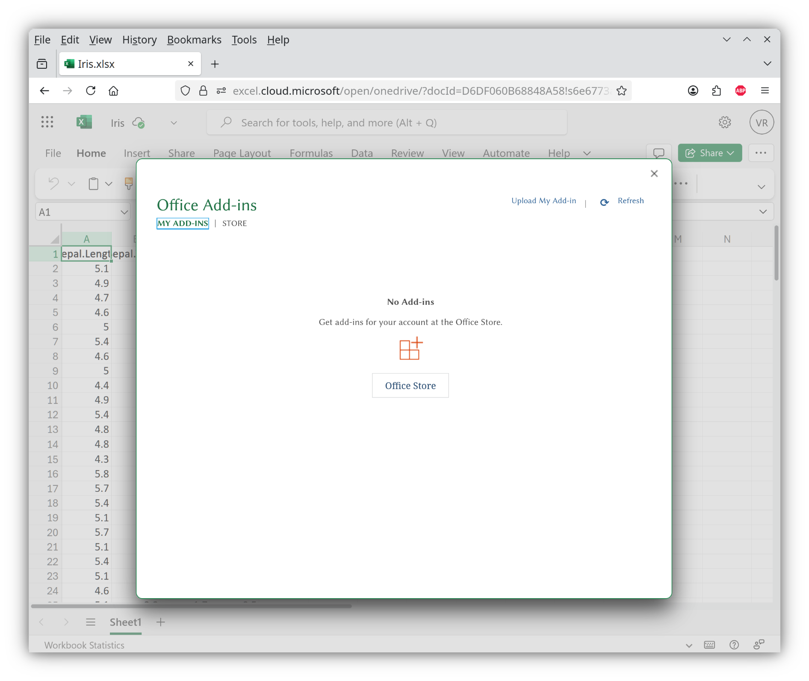

# XLSBoost Excel Add-in

Installation instructions for [Microsoft Excel for the Web](https://excel.cloud.microsoft/):

1. Download and save the manifest file into a file in local filesystem.
2. Click **Home** > **Add-ins** to open the "Add-ins" dialog:
  
3. Click **More Add-ins** (lower right) to open the "Office Add-ins" dialog:
  
4. Click **My Add-ins** (upper left). Next, click **Upload My Add-in** (upper right) to open the "Upload Add-in" dialog:
  
5. Choose the manifest file and click **Upload**:
  
6. Wait for the XLSBoost Excel Add-in to load as a Taskpane App:
  
